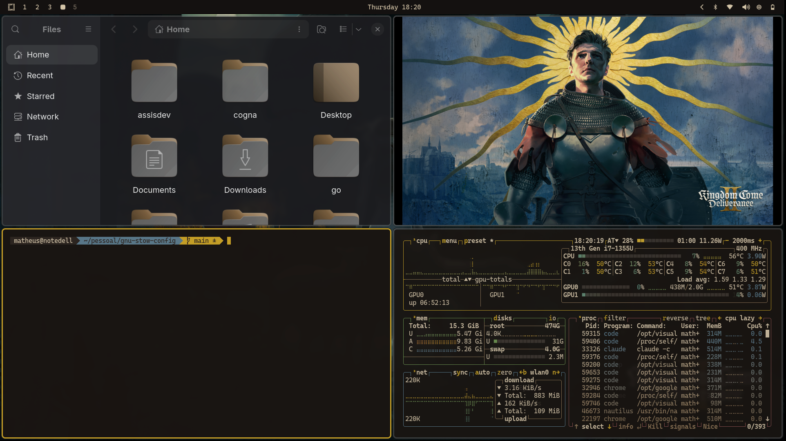

# Kingdom Come Deliverance Theme for Omarchy

A medieval-inspired dark theme for [Omarchy](https://github.com/omarchy/omarchy), featuring earthy browns, golden amber accents, and parchment tones inspired by Kingdom Come: Deliverance.



## Installation

Via Omarchy menu, use the repository URL:
```
https://github.com/MatheusAssisM/omarchy-kingdom-come-deliverance-theme
```

Or manually:
```bash
cd ~/.config/omarchy/themes
git clone https://github.com/MatheusAssisM/omarchy-kingdom-come-deliverance-theme kingdom-come-deliverance
```

Then open Aether (Super + Space) and select the theme.

## Color Palette

| Role | Color | Hex |
|------|-------|-----|
| Background |  | `#1a1512` |
| Foreground |  | `#d4c4a8` |
| Accent |  | `#c9a227` |
| Secondary |  | `#8b7355` |

### Terminal Colors

| Color | Normal | Bright |
|-------|--------|--------|
| Black | `#2d2520` | `#3d3530` |
| Red | `#a54242` | `#b55252` |
| Green | `#6b8e4e` | `#7b9e5e` |
| Yellow | `#c9a227` | `#d9b237` |
| Blue | `#5b7a8c` | `#6b8a9c` |
| Magenta | `#8e5252` | `#9e6262` |
| Cyan | `#5e8a7a` | `#6e9a8a` |
| White | `#c9b896` | `#d4c4a8` |

## Wallpapers

Includes 12 official Kingdom Come: Deliverance wallpapers:

| Wallpaper | Resolution |
|-----------|------------|
| Shepherd | 1920x1080 |
| Rest | 1920x1080 |
| Marching | 1920x1080 |
| Bathhouse | 1920x1080 |
| Hardcore Mode | 1920x1080 |
| Mysteria | 3840x2160 |
| Royal Edition | 3840x2160 |
| Gold Keyart | 3840x2160 |
| Secondary Keyart | 3840x2160 |
| Tertiary Keyart | 3840x2160 |
| Classic KCD | 16:9 |

## Supported Applications

- Hyprland (borders, lock screen)
- Waybar
- Alacritty
- Kitty
- Ghostty
- Neovim (gruvbox-material)
- VS Code (Gruvbox Material Dark)
- btop
- Mako (notifications)
- Walker (launcher)
- SwayOSD
- Chromium

## Credits

- Wallpapers: [Deep Silver / Warhorse Studios](https://www.deepsilver.com)
- Inspired by: Kingdom Come: Deliverance

## License

MIT
